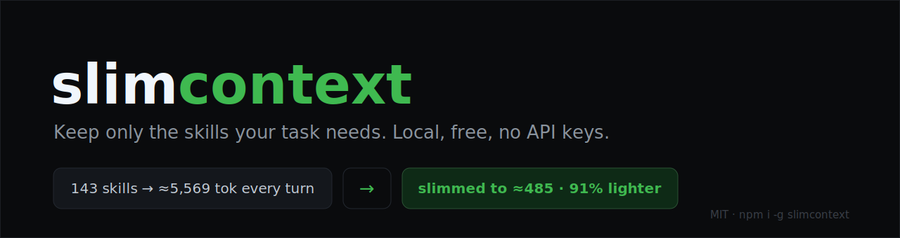
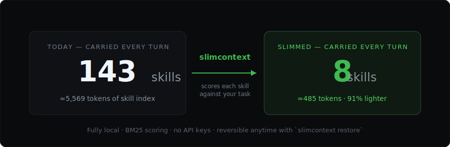
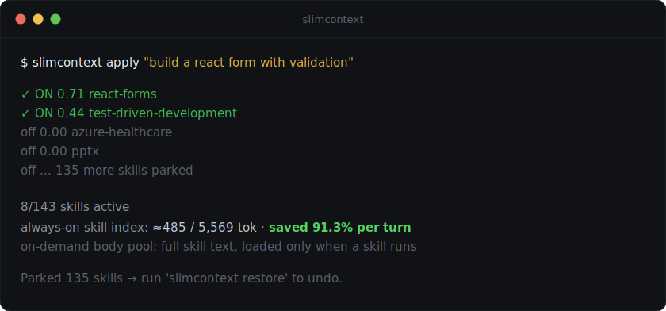
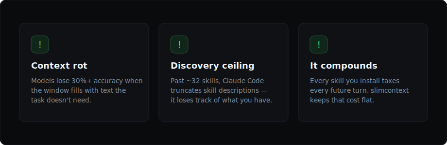

<p align="center">
  
</p>

<p align="center">
  
  =18">
  
  
  
</p>

<p align="center">
  <b>You installed 143 skills. Your AI agent loads all 143 to fix one bug.</b><br>
  slimcontext scores your skills against the task at hand and keeps only the ones that matter —
  fully local, free, with a token-savings dashboard.
</p>

---

## What it does

<p align="center">
  
</p>

Claude Code uses **progressive disclosure** for skills: it keeps a **name + description for
every installed skill** in context on every turn — the skill *index* — and loads a skill's full
`SKILL.md` body only when that skill is actually used. The index is the recurring cost: with 143
skills installed it's **≈5,569 tokens carried into every turn**, before you've typed anything.

slimcontext scores those skills against your task and keeps only the ones that matter.

<p align="center">
  
</p>

That's a real run against a developer's actual `~/.claude/skills/` directory. For a "build a
React form" task, slimcontext keeps the 8 relevant skills — the always-on index drops from
**≈5,569 to ≈485 tokens, 91% lighter, every turn.** (The full skill *bodies* — ≈684k tokens
once the workflow files skills reference are counted — load only on demand; slimming stops
irrelevant ones from ever loading.)

## What it saves

slimcontext trims the **always-on skill index** — every installed skill's name + description,
carried into context on *every turn*:

| | Tokens per turn |
|---|---|
| Full index — 143 skills | ≈5,569 |
| Slimmed — the ~8 a task needs | ≈485 |
| **Saved** | **≈5,084 — ~91% lighter** |

A focused agentic session runs **~25 turns**, so that's roughly **≈127,000 tokens** of
skill-index context kept out of the window across a session. In multi-agent workflows it
compounds — every subagent sees the slimmed skills directory too.

It also caps the **on-demand body pool**: a parked skill can't pull its referenced files —
`gsd-execute-phase` alone is ≈50k tokens when it fires.

> **Honest notes:** the ≈5,569 index figure is a lower bound (it excludes Claude Code's
> per-skill structural framing); "~25 turns" is a typical-session estimate; and prompt caching
> makes re-sending the index cheap, so the win is mostly context-window headroom and sharper
> answers rather than raw API cost.

## Why it exists

<p align="center">
  
</p>

- **Context rot is real.** Every frontier model tested by Chroma in 2026 loses 30%+ accuracy at
  mid-window positions — well before the window is "full." Unused skill text isn't free; it
  actively degrades answers.
- **The discovery ceiling.** Past ~32 installed skills, Claude Code truncates even the skill
  *descriptions*. Native lazy skill-loading was requested ([claude-code#16160](https://github.com/anthropics/claude-code/issues/16160))
  and closed "not planned."
- **Skill libraries only grow.** Superpowers, GSD, marketplaces — the more you install, the more
  every turn costs, unless something prunes intelligently.

## Install

```bash
# install from GitHub (the npm name `slimcontext` is taken by an unrelated package)
npm install -g github:tommisullivan/slimcontext

# one-time: register the /slimcontext menu + the advisory hook in Claude Code
slimcontext init
```

Restart Claude Code once, then type `/slimcontext`.

Prefer not to install globally? Try it once with `npx`:

```bash
npx github:tommisullivan/slimcontext list
```

Node 18+. No native modules, no model downloads, no API keys.

## Use it

### From inside Claude Code — `/slimcontext`

After `slimcontext init` and a Claude Code restart, type **`/slimcontext`** — an
in-editor menu to slim skills for the current task, restore everything, toggle the
hook, or view savings.

### From the terminal

| Command | What it does |
|---|---|
| `slimcontext list` | Every skill you have and what it costs in tokens |
| `slimcontext score "<task>"` | Rank skills against a task — read-only, changes nothing |
| `slimcontext apply "<task>"` | Park irrelevant skills so your next session starts lean |
| `slimcontext restore` | Put every parked skill back |
| `slimcontext init` | Install the `/slimcontext` menu + advisory hook |
| `slimcontext enable` / `disable` | Toggle the advisory hook |
| `slimcontext stats` | The token-savings dashboard |

## How it works

slimcontext ranks skills with **BM25** — the same lexical ranking family Claude Code's own MCP
Tool Search uses — plus optional per-skill trigger rules. Deterministic, runs in milliseconds,
no GPU, and **nothing ever leaves your machine**.

- `score` — dry run; shows the ranking, changes nothing.
- `apply` — moves low-scoring **user** skills into `~/.slimcontext/parked/`. Project skills
  (a repo's `.claude/skills/`) are never touched. Fully reversible with `restore`.
- the hook — silently injects routing context for the model on every prompt and logs
  telemetry to a greppable JSONL ledger. Set `SLIMCONTEXT_VERBOSE=1` to also see a
  per-prompt chat line ("slimcontext · N of M skills relevant"); it's off by default
  because it adds noise on every chat.

### Optional: per-skill manifest

Drop a `slimcontext.yaml` into any skill directory to tune activation:

```yaml
alwaysLoad: false                 # true = always active, regardless of task
triggers:
  keywords: [kubernetes, helm, k8s]
  extensions: [tf, yaml]
dependsOn: [design-tokens]        # activate these whenever this skill activates
```

## Does it hurt answer quality?

Honest answer: **only if the wrong skills get dropped** — and the two modes differ sharply.

- **The advisory hook is quality-safe.** It never removes a skill — it only adds a short "these
  look relevant" note. Neutral worst-case; usually *helps* (a leaner context is a sharper one).
- **`apply` carries the real risk.** It physically parks skills. Guard rails: `topK` defaults to
  8, `minScore` defaults to 0 (only *zero*-scoring skills are parked), `alwaysLoad` pins
  must-haves, and `restore` is always one command away.

The v0.1 scorer is BM25 — excellent on keyword overlap, blind to synonyms. If a result looks
off after `apply`, `restore` and re-run with a higher `--top`. Semantic scoring lands in v0.2.

## How it compares

| | slimcontext | claude-skills-supercharged | Claude Code native |
|---|---|---|---|
| Skill relevance scoring | ✅ BM25 + triggers | ✅ LLM intent scoring | ⚠️ progressive disclosure only |
| Cost per prompt | **$0 (local)** | ~$1–2/mo (Haiku calls) | $0 |
| Token-savings dashboard | ✅ | ❌ | ❌ |
| Works offline / private | ✅ | ❌ | ✅ |

slimcontext deliberately does **not** touch MCP tool loading — Claude Code shipped native "MCP
Tool Search" in January 2026. This tool is about your *skills*.

## Roadmap

- [ ] **v0.2** — optional local embedding backend (MiniLM) for semantic scoring beyond keywords.
- [ ] **v0.2** — first-class adapters for Cline, opencode, Continue.dev, Aider.
- [ ] **v0.3** — **automatic focus**: slimcontext re-stages skills on its own as your task shifts — no manual `apply`.
- [ ] **v0.4** — **slimcontext for OpenClaw**: bring skill scoring to OpenClaw's ClawHub skill ecosystem.

_Shipped:_

- [x] **v0.1.7** — the chat-visible hook line is now opt-in (`SLIMCONTEXT_VERBOSE=1`); by default the hook injects routing context for the model silently, so it doesn't print "N of 143 skills relevant" under every chat. Install fixed too — the npm name `slimcontext` is taken by another project, so install from GitHub: `npm install -g github:tommisullivan/slimcontext`.
- [x] **v0.1.6** — smarter BM25: stemming, compound-word splitting (camelCase / kebab / snake), and a built-in tech-synonym table (auth↔login, k8s↔kubernetes, migration↔migrate…). A real first step toward the embedding backend.
- [x] **v0.1.5** — follow skill file-references for an honest on-demand body-pool figure.
- [x] **v0.1** — BM25 scoring, `/slimcontext` menu, advisory hook, token-savings dashboard, self-update.

## Contributing

```bash
git clone <repo> && cd slimcontext
npm install && npm test     # 35 tests, no external dependencies
```

Issues and PRs welcome.

## License

MIT
